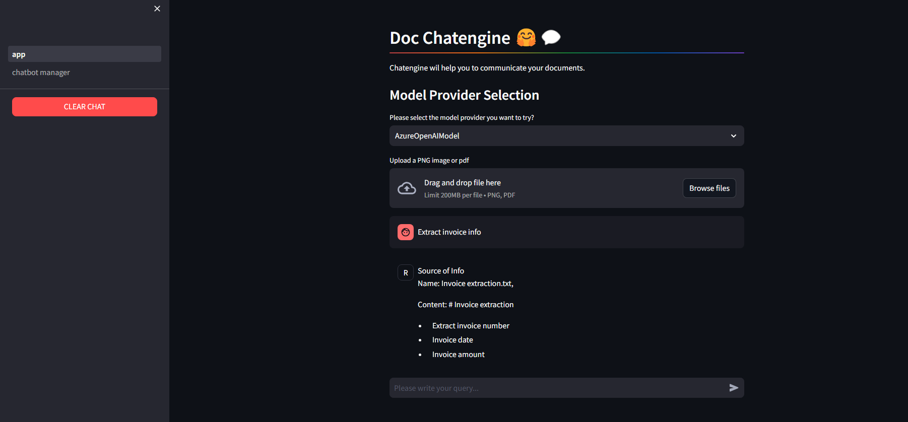

# Multimodal-RAG-Document-Chatengine
A customized chat bot and document parser builder app using Multimodal RAG mechanism.
## Usecase
- Built a generic prototype RAG builder application for particular use-case.
### Knowledgebase-Customizer
- We can set the context by providing the context data in this customizer page.

### Customized chatbot for interaction.
- We can interact the customized RAG bot through this page.


## Environmental variables
Please set these environmental variable before running the solution.
| Environment Variables      | Description | Default |
| :----        |    :-----:   |    ---:    |
| ```OPENAI_API_KEY```      | OpenAI api key       |    |
| ```OPENAI_EMBEDD_MODEL```   | Name of the openAI embedding model        |    ```text-embedding-ada-002```  |
| ```PINECONE_API_KEY```      | Pinecone vectorDB key       |    |
| ```PINECONE_ENVIRONMENT```      | Pinecone environment name      |    |
| ```PINECONE_INDEX_NAME```      | Pinecone index name       |    |

- ## Need to update few more env name

## How to Run
After download the chatter repository, need to follow the mentioned steps.
- Install all the requested packages using this command before running the solution.

    ``` pip install -r requirements.txt ```
- To run the solution please type the below commands

  ``` streamlit run app.py ```
## Solution Overview
Solution consist of mainly 2 parts, they are given below.
* Chatbot Manager
* chatbot

### Chatbot Manager
It is a configurable UI option, which is provided in the streamlit UI for updating user to build a personalized chatbot.
Its have mainly three components
* Input text file from user
* An embedding framework - Here we used OpenAI embeddings
* A Vector DB - Pinecone id used here to store and retrieve data.

### RAG Powerd Chatbot
Personalized chat section is also available in the UI. In the backend its have mainly 3 steps
* Context Retrievel
* Context Augmenter
* Response Generator
#### Solution Advantages
- Base configuration classes are added for every components. So it is easy to use add new technologies along with the existing ones.
- Simple and minimal changes is only needed to customize the solution.
- Streamlit based UI is given for user interaction. 
  
## Future Scope
